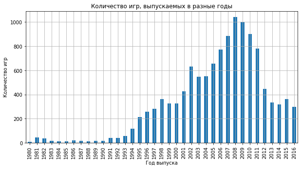
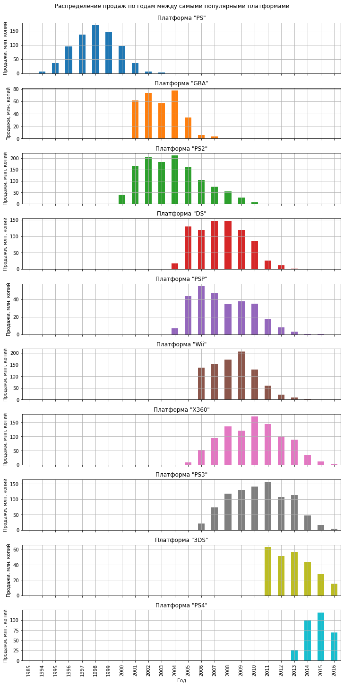
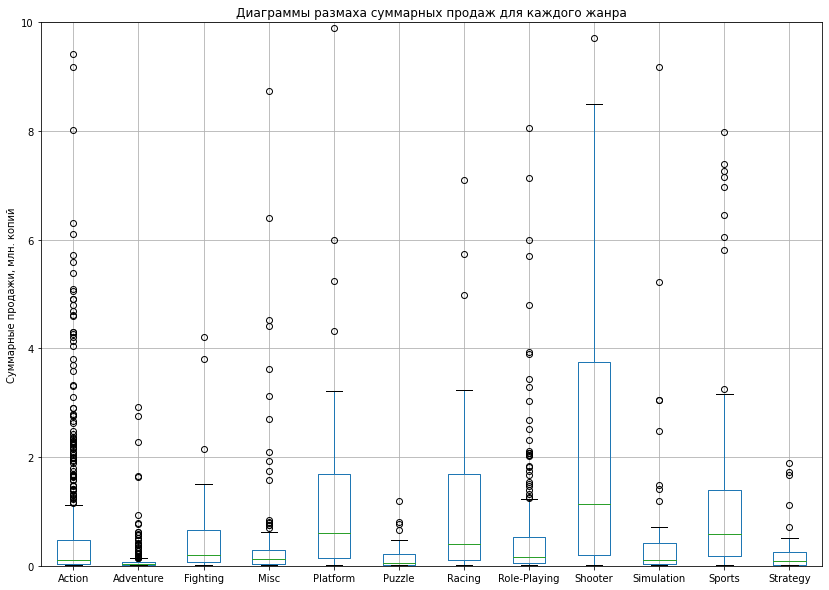

# Сборный проект №1. Исследование рынка видеоигр

Из открытых источников доступны исторические данные о продажах игр, оценки пользователей 
и экспертов, жанры и платформы (например, Xbox или PlayStation). Нужно выявить определяющие 
успешность игры закономерности. Это позволит сделать ставку на потенциально популярный 
продукт и спланировать рекламные кампании.

Для исследования предовствалены данные до 2016 года. Предположим, что сейчас декабрь 2016 г., 
необходимо спланировать кампанию на 2017-й. 

**Цель проекта - отработать принцип работы с данными и выявить определяющие успешность игры закономерности, 
что позволит сделать ставку на потенциально популярный продукт и спланировать рекламные кампании.**

## Приёмы, которые демонстрирует проект
1. Манипуляции с данными средствами **pandas**
1. Обработка пропусков в данных
1. Исследование данных и выводы о закономерностях
1. Тестирование статистических гипотез: проверка гипотезы о равенстве средних с помощью **scipy.stats.ttest_ind**
1. Оформление графиков с **matplotlib**
1. Интерпретация резлуьтатов и формирование вывдов согласно цели исследования

## Примеры графиков из исследования
Ниже приведены некоторые графики из разделов с исследованием данных.

Динамика развития рынка видеоигр:  

Продажи игр для самых популярных платформ:  

Суммарные продажи игр разных жанров:  

